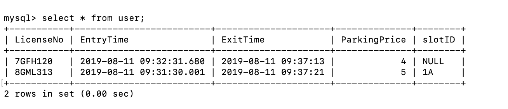

# Smart-AI-Parking

[Web Application that calculates Dynamic Parking price based on the no. of minutes the Vehicle is parked.](https://github.com/NithyaKuchadi/GRUBHUB-Simulation-using-MERN-Stack/blob/master/README.md)

Used OpenAlpr for LicenseplateRecognition.

Database Screenshot:

Required installation for license plate recognition:
1. Tesseract
2. OpenCV v2.4.8+ 
3. Log4cplus
4. OpenAlpr
5. matplotlib

OpenCV & OpenAlpr installation on Mac:

brew install cmake pkg-config

brew install jpeg libpng libtiff openexr

brew install eigen tbb

brew install wget

sudo xcodebuild -license

git clone https://github.com/sunfic/openalpr-opencv4

cd openalpr-opencv4/src

mkdir build

cd build

cmake .. -DCMAKE_BUILD_TYPE=Release -DCMAKE_CXX_FLAGS="-std=c++11"

make

sudo make install

pip install opencv-python openalpr numpy matplotlib

License plate recognition Execution :

cd sandbox/licenseplate(go to the folder where the license plate file is stored)

python licenseplaterecognition.py(file name)

The below lines of code has to be modified for executing licenseplaterecognition.py file

Runtime configuration path should be specified in
alpr = Alpr("us", "/etc/openalpr/openalpr.conf", "/usr/local/share/openalpr/runtime_data")

The default region is set to california:
alpr.set_default_region("ca")

Video path should be specified in
cv2.VideoCapture("/Users/nithyakuchadi/sandbox/licenseplate/ka.mov")

Tracking file execution:

Step 1. 
python main.py --image images/Parking_Img.png --data data/coordinates_1.yml --video videos/IMG_3156.MOV --start-frame 1

When the above line is executed in the terminal, the image Parking_Img.png pops up. In this image, we need to specify the coordinates and labels of the parking slots.
These coordinates with labels will be stored in coordinates_1.yml file. These coordinates will be tracked for vehicle detection. The labelling and specifying the coordinates is a one time process in the application.

After step 1 is done, the file can be executed by using the command in step 2.

Step 2.
python main.py --data data/coordinates_1.yml --video videos/IMG_3156.MOV --start-frame 1

The coordinates stored in coordinates_1.yml will be used for tracking the vehicles in the parking lot.
Please specify your video after - -video.
